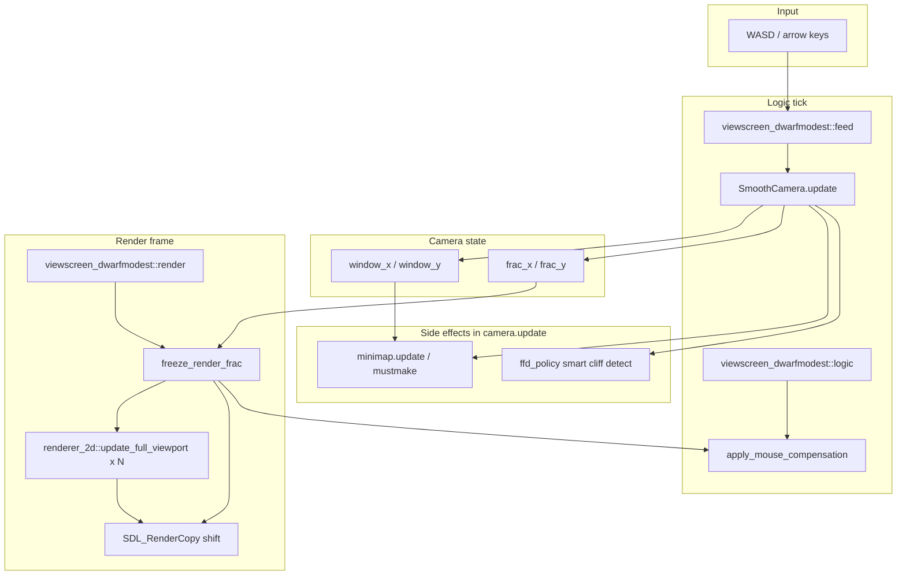

# SmoothPan Architecture

How SmoothPan implements smooth sub-tile panning in **Dwarf Fortress Premium** (DF 50.x) without modifying the game binary.

**Version documented:** 3.14.1 (stable pan/MMB foundation). Smooth zoom plan: [PLAN_SMOOTH_ZOOM.md](PLAN_SMOOTH_ZOOM.md) (parked — revisit with edge-stretch lessons).

---

## Design principle: split-brain camera

DF's simulation and vanilla scroll logic assume **integer tile coordinates**. SmoothPan keeps that invariant and applies sub-tile motion **only at render time**.

| Layer | State | Updated when |
|-------|-------|--------------|
| **Logic** | `window_x`, `window_y` | Integer tile center; changes only when crossing a tile boundary |
| **Visual** | `frac_x`, `frac_y` ∈ [0, 1) | Sub-tile remainder; updated every logic tick while panning |
| **Render** | `render_frac_x/y`, `render_shift_x/y` | Snapshot of frac at frame render start; constant for entire frame |

```text
true_x/y  (float, unbounded)
    │
    ├─ floor → window_x/y     (written to df::global::window_x/y on change)
    └─ frac   → frac_x/y      (atomic floats, sub-tile part)

render_shift_x = render_frac_x * cell_size
render_shift_y = render_frac_y * cell_size
cell_size      = viewport_zoom_factor / 4   (pixels per map tile)
```

Vanilla cursor-key pan is **suppressed** in `viewscreen_dwarfmodest::feed` — keys set direction flags but are erased before vanilla tile-step scroll runs.

---

## End-to-end data flow



---

## Coordinate systems

Premium DF uses several overlapping spaces. Misunderstanding these caused most historical bugs.

| Symbol | Unit | Meaning |
|--------|------|---------|
| `viewport_zoom_factor` (`z`) | px | Pixels per **graphical map tile** at current zoom |
| `cell_size` | px | `z / 4` — pixels per 4×4 text cell; **use this for shift** |
| `main_viewport->dim_x/y` | cells | Viewport size in 4×4 text cells (4 cells = 1 map tile) |
| `main_viewport->screen_x/y` | px | Viewport origin on screen (fluctuates) |
| `renderer_2d::origin_x/y` | px | Tile bake grid origin (~6, 6); **constant** |
| `window_x/y` | tiles | Camera center in world tile coordinates |
| `precise_mouse_x/y` | px | Cursor offset from **origin**, not from screen |
| `mouse_x/y` | cells | Text grid index = `precise / cell_size` |

Viewport pixel bounds:

```text
left   = main_viewport->screen_x
top    = main_viewport->screen_y
width  = dim_x * cell_size
height = dim_y * cell_size
```

Camera clamp half-extent in tiles: `dim_x / 8`, `dim_y / 8`.

**Critical:** Never use `tile_pixel_x` (~14) as cell size — map tiles are `z/4` (~32–64 px depending on zoom).

---

## Hook layers

### 1. DFHack vtable interposes (`smoothpan.cpp`)

| Hook | Role |
|------|------|
| `viewscreen_dwarfmodest::feed` | Capture WASD; erase vanilla scroll keys; apply mouse compensation |
| `viewscreen_dwarfmodest::logic` | Mouse compensation on logic tick |
| `viewscreen_dwarfmodest::render` | `SmoothCamera.update()`, freeze frac, call vanilla render |

Mouse compensation runs in **feed** and **logic** only — not during render — so UI hover is not corrupted every frame.

### 2. Renderer vtable (`renderer_hook.cpp`)

Interposes `df::renderer_2d`:

| Method | Role |
|--------|------|
| `update_full_viewport` | Gate map passes; snap clip rect; track pass index for telemetry |
| `render` | Clear pass flags at frame boundary |

**Map-pass gate:** Any viewport whose `dim_x/dim_y` match the main map viewport is treated as map content (main layer, lower-z show-through, off-map reveal). All such passes must receive the same `render_shift` or layers misalign.

**Shift gate (`is_map_tile_shift_pass`):** Subset of same-dim passes that actually receive SDL blit shifts — excludes toolbar chrome and side minimap bakes while including lower-z siblings.

**Clip snap:** Map-pass clip rect snapped to viewport bounds from `origin_x/y` so shifted tiles cannot paint into the left/top screen margin (fixes edge shimmer).

### 3. SDL MinHook (`sdl_hook.cpp`)

| API | When active | Effect |
|-----|-------------|--------|
| `SDL_RenderCopy` / `Ex` | Map blit, classified | Subtract `lround(render_shift)` from dest |
| `SDL_RenderCopyF` / `ExF` | Entity / float blits | Subtract float `render_shift` |
| `SDL_RenderSetClipRect` | Map pass | Log / snap clip (telemetry) |
| `SDL_RenderPresent` | Always (when enabled) | F7/F9 dumps; perf frame timing |
| `SDL_GetMouseState` | Debug `both` mode only | Off in production GPS mode |

Shift is applied only when `g_in_main_viewport_update` or controlled post-viewport map compositing is active — **not** for HUD overlays drawn afterward.

**Edge gaps (3.14.1):** Sub-tile pan shifts map blits left/up, leaving an unbaked strip on the right/bottom. The viewport buffer is fixed-size (`dim_x × dim_y`); painting outside it requires vanilla rebake/realloc — not safe to hack. Instead, the last column/row grid tiles extend their **destination width/height in float** to the viewport edge in the **same** `RenderCopyF` as the pan shift (`map_blit_extend_viewport_edges`). One integrated stretch per frame tracks `render_shift` without a second fill pass or extra memory.

All hooks no-op when `is_enabled == false`.

---

## Blit classification (`viewport.cpp`)

Each SDL blit is classified before shifting:

**Shift when all true:**

1. Intersects strict map viewport bounds
2. Not in top/bottom toolbar bands
3. Not interface glyph size (14×21) or large panel (≥200×200)
4. Not Premium info panel region
5. Not overlapping a **leaf** widget (overlay panels)

**Do not gate solely on SDL clip rect** — Premium DF rarely sets a viewport-matching clip.

Entity sprites use `RenderCopyF`; width/height in the FRect are not pixel sizes — classification uses position and viewport intersection.

The same **UI gate** (`mouse_gate_should_compensate`) decides whether GPS mouse compensation applies.

---

## Mouse compensation (`mouse_comp.cpp`)

Production: **GPS-only** (see [MOUSE_SYNC.md](MOUSE_SYNC.md)).

```text
SDL physical cursor
    → vanilla sets precise_mouse_x/y from origin
    → SmoothPan adds round(render_shift_x/y) when over map
    → getMousePos() = window_x + precise/cell  → correct world tile
```

| Mode | SDL hook | GPS bump | Use |
|------|----------|----------|-----|
| `gps` | Off | Yes | **Production default** |
| `both` | Yes | Yes | Debug (F8 toggle) |
| `sdl` / `none` | Varies | — | Diagnostics only |

Never bump `mouse_x/y` or `window_x/y` for mouse sync.

---

## Camera & physics (`camera.cpp`)

- Velocity-based pan with friction; direction from held keys
- Edge clamp against world bounds
- `freeze_render_frac()` at render start — **one shift per frame**, no Present-time resnapshot
- Zoom change resyncs `true_x/y` from current `window_x/y`

### Minimap integration

SmoothPan writes `window_x/y` directly, bypassing vanilla scroll dirty flags. Minimap state is updated manually:

| Flag | When | Cost |
|------|------|------|
| `minimap.update = 1` | Every tile step | Cheap |
| `minimap.mustmake = 1` | Throttled during pan; always on pan stop | **Expensive** (~12–20 ms) |

**Default (lazy):** mustmake at most every 2 s while panning + one rebuild when WASD released.

Modes: `lazy` | `outline` (80 ms) | `full` (every tile) | `fast` (update only, frozen outline).

Tile-step `force_full_display_count >= 1` is always set so DF marks the view dirty for minimap rectangle updates.

---

## FFD policy (`ffd_policy.cpp`)

During sub-tile pan, DF may skip rebaking lower-z viewport passes unless `gps->force_full_display_count >= 2`. Without it, open-space lower-z tiles **jiggle** at cliff edges.

**Smart mode (default):** Once per tile step, scan visible tiles:

| Condition | Need pan ffd |
|-----------|--------------|
| Off-map / invalid tile on viewport edge | Yes |
| Open air, ramp, stair at current z | Yes |
| Floor with flow-down (grate/hatch) | Yes |
| Solid tile beside open air (cliff) | Yes |
| Enclosed flat hall | **No** — skip pan ffd bump |

Cache keyed on `(window_x, window_y, window_z)`; stable between tile steps.

Console: `smoothpan ffd always|smart|off`

---

## Performance profiler (`perf.cpp`)

Zero overhead unless capturing. **F7** starts 450-frame present-to-present timing.

Output: `dfhack-config/smoothpan/smoothpan_perf.txt`

Tags per frame: pan state, ffd level, ffd_skip reason, minimap mustmake, hook microseconds.

---

## Debug & telemetry

| Tool | Output file |
|------|-------------|
| F7 / `smoothpan perf` | `smoothpan_perf.txt` |
| F9 / `smoothpan dump` | `smoothpan_telemetry.txt` + BMPs |
| F10 / `smoothpan classify` | `smoothpan_classify.txt` |
| F11 / `smoothpan probe` | `smoothpan_probe.txt` |
| `smoothpan trace` | `smoothpan_trace.txt` |

All paths via `debug_paths.cpp` → `{dfhack-config}/smoothpan/`.

---

## Source file map

| File | Responsibility |
|------|----------------|
| `smoothpan.cpp` | Plugin init, vtable hooks, console commands, hotkeys |
| `camera.cpp` | Camera physics, frac freeze, minimap flags, tile-step ffd |
| `camera.h` | `SmoothCamera` class API |
| `sdl_hook.cpp` | MinHook SDL shift, Present dumps, clip tracking |
| `renderer_hook.cpp` | `update_full_viewport` interpose, map-pass gates, clip snap |
| `viewport.cpp` | Viewport math, blit classification, UI gate |
| `mouse_comp.cpp` | Mouse mode enum, GPS boot, compensation apply |
| `ffd_policy.cpp` | Smart cliff scan, pan ffd apply |
| `perf.cpp` | F7 detailed FPS profiler |
| `shift_mode.cpp` | A/B shift backend enum (SDL production path) |
| `probe.cpp` / `trace.cpp` | Pipeline instrumentation |
| `debug_paths.cpp` | Portable log paths |
| `frame_seq.cpp` | Frame sequencing helpers |
| `version.h` | `SMOOTHPAN_BUILD_VERSION` string |
| `deploy.ps1` | Windows build + copy + version verify |

Bundled: **MinHook**, **SDL2** headers (hook targets game's SDL2.dll at runtime).

---

## What we deliberately do not do

| Avoided approach | Reason |
|------------------|--------|
| Modify `window_x/y` every frame for visual pan | Breaks simulation, mouse, minimap |
| Shift all SDL blits | HUD jiggles |
| Shift only tile-sized blits | Float entity sprites judder |
| Mutating `dim_x/y` during viewport bake without realloc | Buffer overrun — diagonal garbage, crash (3.13.6) |
| SDL zoom scale > 1 without margin texels | Black bands + fill-in as scale eases (3.13.4–3.13.6) |
| Overscan without render_shift compensation | Asymmetric gaps; 3.4.0 regression |
| Separate edge fill blits | Second pass desync / shimmer; integrated tile stretch preferred (3.14.1) |
| GPS + SDL hook both at boot | Double compensation |
| Pulse ffd on cliffs | Visible 1-frame lower-z lag |
| Per-frame full map scan for ffd | Cost; visibility stable between tile steps |

See [GOLDEN_PATH.md](GOLDEN_PATH.md) for the full anti-pattern list.

---

## Platform & scope

- **Target:** DF Premium, `viewscreen_dwarfmodest` (fortress mode)
- **OS:** Windows (key state via `GetAsyncKeyState`)
- **DFHack:** Standard plugin; links against `dfhack.dll`, uses generated `df::` types
